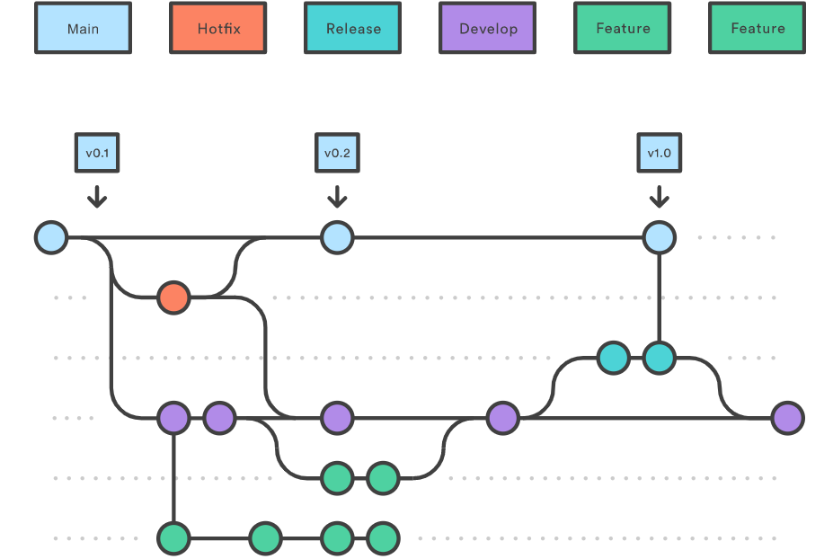
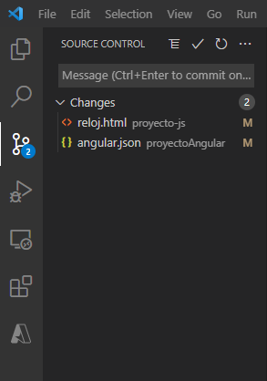
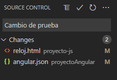
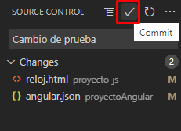
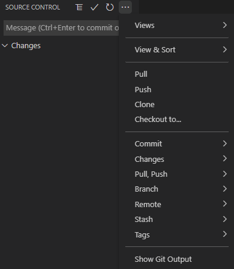
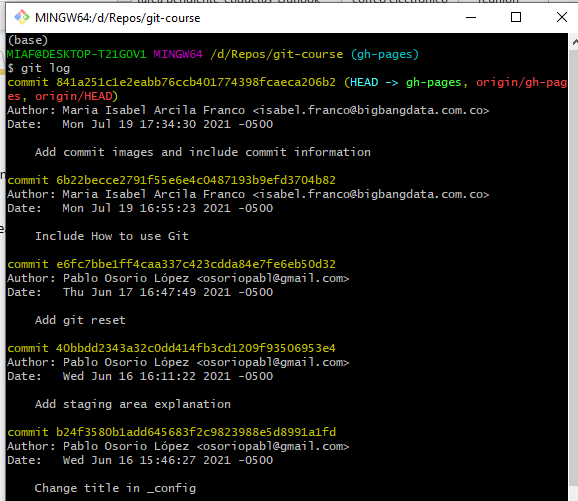

<style type="text/css">
  .center-image
    {
        margin: 0 auto;
        display: block;
    }
</style>

# Explicacion

Los sistemas de control de versiones *VCS* (por sus siglas en inglés)
son herramientas que facilitan hacer un seguimiento sobre cambios
"*proyecto.txt*", "*proyecto1.txt*", "*proyectofinal.txt*", 
"*proyectofinalestesi.txt*" ...

{: .center-image }

¿Por qué se considera tan valioso? Cuando se está trabajando solo se guardan
*capturas* del proyecto, guardando una serie de notas de por qué se hicieron 
ciertos cambios, permite trabajar en paralelo en rutas de desarrollo diferentes
y más. Pero son especialmente importantes cuando se trabajan con múltiples 
personas, permitiendo escribir la historia de código entre todos, ver 
sencillamente los cambios de los otros y resolver conflictos cuando dos
usuarios están cambiando las mismas lineas de un archivo.  
Aunque existen múltiples *VCS*, Git es el más usado actualmente. Sin embargo, 
Git es conocido por lo dificl que es aprenderlo, pero sus conceptos más básicos

{: .center-image }

Entonces git es un sistema de versionamiento de versiones, ¿pero es lo mismo
que *GitHub*, absolutamente NO. Git es un programa que se instala dentro de tu
computador (no en la nube). GitHub es un _hosting_ de repositorios git,
es decir, si bien nosotros decidimos guardar una copia de nuestro repositorio
git en GitHub, también podríamos utilizar cualquier otro servicio como 
BitBucket, GitLab, o hasta
[crear uno privado](https://git-scm.com/book/en/v2/Git-on-the-Server-The-Protocols)
con nuestros propios protocolos de seguridad en la organización.

## Conceptos

Git modela la historia de una colección de carpetas y archivos como una serie
de Snapshots (instantáneas) en git llamados **commit**.
En terminología Git, un archivo es un **blob**
y son simplemente bytes. Un directorio se conoce como **tree** y en su definición
incluye referencias a blobs o a otros trees.  En la siguiente figura se muestra un
ejemplo.

```console
<root> (tree)
|
+- foo (tree)
|  |
|  + bar.txt (blob)
|
+- baz.txt (blob)
```

### Commits

Una manera relativamente sencilla e ingenua de modelar los snapshots sería una historia lineal.
Gráficamente sería algo así:

```console
A1 <-- A2 <-- A3 <-- A4
```

En este diagrama, las `A#` representan los commits, y la flecha apunta al commit anterior,
es decir, el commit más a la derecha es el último y el commit anterior
(que a veces se llama padre) es el que esta consecutivamente a su izquierda.  
Pero en git, un commit no está limitado a contener un solo padre, puede tener
múltiples esto representaría trabajar bajo dos tareas en paralelo y después
unir su trabajo. Algo así:

```console
A1 <-- A2 <-- A3 <-- A3B2
       ^             /
        \           v
        B1  <----  B2
```

En git los commits son inmutables. Esto no significa que los errores
no se puedan borrar de la historia, simplemente que editarlos implicaría
crear nuevos commits. 

### Working directory-Staging Area-Repository

¿Tendría sentido que cada vez que hagamos commit, git guardara
todo los archivos con cambios que tenemos en nuestra carpeta e hiciera
el commit con estos? Algunos sistemas de versionamiento funcionan así
pero no git. En git queremos commit _limpios_ y esto no siempre
es alcanzable haciendo commit  de toda la carpeta. Por dar un ejemplo,
pensemos en el caso en el que implementemos dos funciones, una ya funcional
y otra que aún contiene ciertas fallas, solamente quisieramos guardar en un
nuevo commit el avance en la que ya funciona y probablemente hacer otro commit
con la otra cuando ya este terminada. La manera de git de acomodarse a estos
casos es mediante la staging area.  

En git tenemos 3 diferentes zonas de trabajo _working directory_, _staging area_ y _repository_.
Por regla general, _working directory_ es el estado actual de mi directorio,
con todos los cambios nuevos (incluyendo a los cuales aún no he hecho commit).
El _staging area_ representa los archivos a los cuales planeo agregar en mi siguiente commit y
_repository_ es el repositorio donde solamente se guarda la información a la cuál se le hizo commit.  

Entonces imagenemos el caso anteriormente descrito, para yo solamente hacer un commit sobre un
archivo (funcion_1.py) puedo hacer lo siguiente:

```console
git add funcion_1.py
```

En este caso, ya la función 1 estaría en mi _staging area_ y para guardar estos cambios en el
repositorio, simplemente haría:

```console
git commit -m "Implementa funcion 1"
```
Entonces ya estos cambios estarían guardados en el repositorio.

{: .center-image }


### Realizar buenos commits - Buenas prácticas

Con el fin de llevar un repositorio ordenado y de fácil entendimiento para cualquier persona que acceda a el repositorio (e incluso nosotros mismos al cabo de un tiempo) es importante tener en cuenta algunos consejos, que si bien no son leyes o estándares, facilitarán el manejo de repositorios. 

1. Ser coherente con el flujo de trabajo de git, realizar los commits en las ramas adecuadas. 
2. En cuanto a los mensajes, hay algunas buenas prácticas que pueden hacer un commit más legible. 

    -	Los commits tienen dos partes principales, el asunto y el mensaje. Si el contenido del commit se puede especificar en el asunto, no es necesario el mensaje.
	- La línea del asunto no debería extenderse más de 50 caracteres y la del mensaje no más de 72. Esto con el fin de que pueda visualizarse en diferentes dispositivos y plataformas. 
	- Dar descripciones de lo que se está realizando, por ejemplo si se está haciendo un merge, el mensaje apropiado debería ser merge branch 'nombre-rama'.
3. Enviar cambio sen un pull request, una solicitud que se hace al repositorio cuando se envía código con cambios. 
4. Incluir solo los archivos que se estén utilizando. 


### Referencias

Para git, todos los objetos (**commit**, **blob**, **tree**) están
referenciados por su [SHA-1](https://en.wikipedia.org/wiki/SHA-1)
esto puede ser estorboso, ya que los seres humanos no son buenos memorizando
40 carácteres hexadecimales. Por esto, se crean las referencias, las
referencias se hacen a los commits, entre las más generales están
`main` antes llamada `master`, que suele representar el último commit
del código "estable". También a modo de ejemplo, podemos ver la
referencia al commit actual, llamada `HEAD`.

### Ramas

Trabajar con ramas significa que se "aparta" de la línea principal de desarrollo, también conocida como *main* para continuar el trabajo por otra ruta que no interfiera con lo existente en la principal. 

Recordando que los commits son instantáneas o *snapshots* de los cambios realizados, las ramas son de alguna forma, una referencia a estas capturas. 

Pensando en el repositorio como un árbol, una rama tiene el contenido del tronco, pero además características diferentes que hacen a esta rama única e independiente de las demás.

### Fusiones: `git merge`

El comando `git merge` combina las diferentes ramas en una única rama. Suponiendo que se saca una rama para una funcionalidad de la rama `main`, se termina con esta funcionalidad y se debe integrar la misma a la rama main. 

### Gitflow

Gitflow es un flujo de trabajo que favorece la integración continua y las prácticas de implementación de [DevOps](https://azure.microsoft.com/es-es/overview/what-is-devops/). Más que incluir comandos diferentes a nivel de Git, es una metodología en la que se asignan funciones específicas a las ramas de cómo deben funcionar e interactuar entre sí. 

Un flujo completo GitFlow, luce de la siguiente forma: 


Se creean principalmente dos ramas, **Main** y **Develop**. La primera almacena el historial "oficial" del repositorio, mientras que la segunda sirve para integrar las diferentes funcionalidades. 

Existen otras ramas de función o **Features**, dado que todas las funciones deben ir en su propia rama, utilizando en lugar de la rama **Master** como rama primaria u origen, la rama **Develop**. 

Además, existen ramas de Publicación o **Release**, que se utilizan cuando ya la rama develop tenga suficientes funcionalidades. Esta rama se extrae a partir de la Rama **Develop** y una vez llega allí, ya no se pueden implementar nuevas funcionalidades. Cuando esta rama está lista, se fusiona con la rama **Main**.

Y para los bugs en producción...


Existen también las ramas de corrección o **Hotfix**, que sirven para reparar las publicaciones de producción, o en otras palabras, lo que está en la rama **Main**. La diferencia entre esta rama y las ramas de **Release** y **Feature**, es que esta se basa en el **Main**. Así puede tenerse la última versión publicada sin interferir con el resto del flujo de trabajo. 


## Configuracion por primera vez

Una vez teniendo git en nuestro computador. Hay que hacer unas pocas
cosas para configurarlo. En general usaremos el comando _git config_
para hacer esto. Las variables de entorno se encuentran en 3 diferentes
niveles.
- `[path]/etc/gitconfig` (`$HOME/.gitconfig` en Windows):
        Variables del sistema, en general no quisieramos tocar este.
- `~/.gitconfig` o `~/.config/git/config`: Variables de usuario.
- `config` archivo que está en cada repositorio git en la ruta `.git/config`.

Puedes ver tus configuraciones y de que ruta vienen utilizando el comando
```console
git config --list --show-origin
```

### Configuraciones básicas

#### Identidad
Git necesita usar un nombre y correo para hacer los commits. Se configuran
para el sistema de la siguiente manera.

```console
git config --global user.name "Pablo Osorio"
git config --global user.email pablo.osorio@bigbangdata.com.co
```

Y si por ejemplo, yo quisiese utilizar un correo diferente para un proyecto
en particular, me puedo meter a la carpeta de ese proyecto y correr los mismos
comandos sin `--global`. Esto sería:

```console
git config user.email pablo.osorio@empresa.com
```

Donde este correo solo se utilizaría para este proyecto y para el resto
seguiría usando el predefinido en global.

#### Editor de texto
Git necesita usar un editor de texto para escribir los mensajes.
Entre los más comunes están _notepad_ (recomendado para iniciar),
_code_ (vscode), _vim_, _emacs_.

Basta con el siguiente comando
```console
git config --global core.editor notepad
```


### Crear repositorio (git)
En git, tu carpeta de archivos incluyendo toda su historia y configuraciones
se llama repositorio. Para crear un respositorio hay que seguir los siguientes
pasos:

- Ve al directorio donde quieras guardar el proyecto.
- Escribe en la consola `git init`.
- `git add <nombre archivo>` para incluir en el repositorio los archivos que queremos.
- `git commit` y se escribe un mensaje normalmente como `first commit` o
  algo describiendo el trabajo hecho.


### .gitignore

El archivo `.gitignore`, es un archivo de texto que le dice a Git qué archivos
o carpetas ignorar en un proyecto.  

Tiene ciertos carácteres especiales utiles de conocer
- `*` se utiliza como una coincidencia comodín.
- `/` se usa para ignorar las rutas relativas al archivo .gitignore.
- `#` Comentarios

Es importante incluir archivos que no sean código acá, por ejemplo, imágenes
generadas por código, copias de seguridad creadas por nuestro editor de texto,
resultados generados de correr un script o datos sensibles.
Como una "regla de dedo" podemos tener la regla de que si no es código o texto,
probablemente no debería ir en el repositorio git.  

Github propone unos genéricos cuando vamos a crear un proyecto y a la gente
también le gusta publicar algunos que van mejorando en la web


```console

# Carpetas con archivos de datos
data/

# Ignorar archivos creados por Jupyter
.ipynb_checkpoints

# Sphinx documentation
docs/_build/

# Configuraciones editories
.vscode/
.idea/

# Ignorar todos los archivos .csv
*.csv
```


### git reset

Git reset es una herramienta que nos permite deshacer cambios.
Aunque muy potente, su uso puede ser confuso y es peligroso no usarla
correctamente. El comando reset funciona para mover una rama
hacia otro commit en particular. Sin embargo, tiene 3 maneras de hacerlo 
`--soft`, `--mixed` y `--hard`.

**--soft** cambia la referencia de la rama a otro commit, pero dejá los archivos
el _working directory_ y _stage area_ sin tocar. Es decir, todo queda como el momento
justo antes de hacer el commit, sin necesidad de hacer `git add`.
**--mixed** es la opción por defecto, tampoco cambia el _working directory_ por lo que
no veremos cambios en los archivos, sin embargo, cambia el _stage area_ por lo que
para decidir cuales cambios queremos conservar tendriamos que volver a añadir cambios
por medio de `git add`. **--hard** PELIGRO, lo más directo y la más usada, se cambia tanto
el _working directory_ como el _stage area_, es decir, los cambios que hicimos ya no se ven
en los archivos y como el `reset` mueve la rama, ya no hay manera de volver a ver estos
cambios.

#### Ejemplo

Supongamos que tengo el siguiente repositorio.

```console
A1 <-- A2 <-- A3 <--   A4
                       ^
                       |
                      main
```

y aplico el siguiente comando. En vez, de ser A#, toca referenciar el commit
al que queremos ir
por su SHA-1, o el nombre de alguna otra rama. Normalmente se usan los SHA-1,
El SHA-1 es un alfanumérico de 40 caracteres de longitud
(ejemplo `540c10349e03d332faf87bb352e87d6a943ed937`)

```console
git reset A3
```
El repositorio quedaría de la siguiente manera, pero NO habrían cambios en
nuestros archivos (_working directory_) ni en  _staging area_.
```console
A1 <-- A2 <-- A3 <--   A4
              ^
              |
            main
```

## ¿Cómo puedo utilizar Git?

Hay diferentes formas de utilizar Git, independiente si se está trabajando en un repositorio remoto o local, en trabajo individual o colaborativo. 

### Git por consola 

Existen las herramientas originales de línea de comandos, como lo son el Terminal en entornos Linux, o el CMD o PowerShell en entornos Linux.

Además de las herramientas nativas de los sistemas operativos, encontramos también herramientas como **Git Bash** que puede llegar a emular la experiencia de línea de comandos de Git, como se realizaría en un entorno Linux. 

### Git en editores de texto
Los editores de texto y los IDE (Entornos de Desarrollo Integrado) que se utilizan popularmente para programar, también tienen compatibilidad con Git, integrando de una forma bastante práctica las funcionalidades y con la comodidad de realizarlo desde el mismo entorno de desarrollo. 

#### Editores de código
- [Visual Studio code](https://code.visualstudio.com/docs/editor/versioncontrol)
- [Atom](https://flight-manual.atom.io/using-atom/sections/version-control-in-atom/)
- [Sublime Text](https://www.sublimetext.com/docs/git_integration.html)
- [Brackets](https://github.com/brackets-userland/brackets-git)

#### IDE (Entornos de desarrollo integrado)
- [Visual Studio](https://docs.microsoft.com/en-us/visualstudio/version-control/git-with-visual-studio?view=vs-2019)
- [NetBeans](https://netbeans.apache.org/kb/docs/ide/git.html)
- [IntelliJ IDEA](https://www.jetbrains.com/help/idea/set-up-a-git-repository.html#put-existing-project-under-Git)
- [Eclipse](https://www.eclipse.org/egit/)

### Git por interfaz gráfica
Existen herramientas de Interfaz Gráfica que sirven para manejar repositorios Git. Son herramientas de terceros que utilizan los usuarios que prefiren las interfaces gráficas que se acomoden a una plataforma en específico. Algunas de estas herramientas son: 

- [GitHub Desktop](https://desktop.github.com/)
- [Sourcetree](https://www.sourcetreeapp.com/)
- [GitKraken](https://www.sourcetreeapp.com/)

Es importante aclarar que con las herramientas de Interfaz Gráfica no es posible acceder a muchos de los comandos que si se pueden utilizar por consola. Existen más clientes de Interfaz Gráfica para Git, los cuales se pueden encontrar en el [siguiente enlace](https://git-scm.com/downloads/guis).

## Y... ¿cómo se hace?

A lo largo de este curso se han tratado diferentes conceptos y las formas de utilizar Git. Ahora, es momento de llevar estos conceptos a la práctica. 

### ¿Cómo hacer un commit?

Anteriormente se definieron los commits y las secciones o áreas de un repositorio Git, como una de las partes fundamentales de todo este mundo de Git. A continuación, cómo se realizan los commits: 

#### Commit desde consola

Antes de realizar un commit, es importante tener en cuenta los dos siguientes comandos: 
```console
git add <archivo>
git rm <archivo>
```
Los anteriores comandos se utilizan para agregar/eliminar archivos al respectivo commit. Los archivos que no se hayan agregado, no se incluirán en el commit. 

El comando más básico para realizar un commit es 
```console
git commit
```
Sin embargo, este comando tiene muchas opciones. Algunas de las más utilizadas se describen a continuación: 

| Opción | Descripción |
| ----------- | ----------- |
| -a | Confirma el "shapshot" de todos los cambios del Working Directory. Solo incluye lo que se haya agregado con `git add` |
| -m "mensaje" | Incluye un mensaje al commit. Por defecto Git abre una ventana en el editor de texto predeterminado, para incluir el mensaje. Si se utiliza esta opción se omite este paso. |
| -am "mensaje" | Este comando es una combinación de los comandos -a y -m. |
| --amend | Esta opción modifica una confirmación anterior. Este comando abre el editor de texto para que el mensaje del commit sea modificado. |

Existen muchas otras opciones, las cuales se pueden consultar en el [siguiente enlace](https://git-scm.com/docs/git-commit#Documentation/git-commit.txt--a).

#### Commits desde editores de texto

Además de poder realizar los commits por consola, también se pueden utilizar los editores de código. En este caso, se mostrará con Visual Studio Code, pero en la documentación oficial de cada editor o IDE se pueden encontrar los pasos.

1. Se realizan los cambios correspondientes a cada archivo y se guardan localmente en la carpeta del repositorio. 

2. En la pestaña de control de versiones aparecen los cambios que se han realizado. 


3. Agregar el mensaje al commit


4. Finalmente se realiza el commit para agregar los cambios al repositorio. 



[Visual Studio Code](https://code.visualstudio.com/docs/editor/versioncontrol) además tiene diferentes opciones para manejo de repositorios, las cuales pueden visualizarse al dar click en los tres puntos superiores. 



### ¿Cómo ver la historia de un repositorio?

Utilizando git localmente, remoto, para trabajo individual o colaborativo, siempre será útil y de gran importancia conocer el histórico de un repositorio, ya que esto permitirá ver no solo el progreso del repositorio, sino identificar posibles puntos críticos o de errores. 

El comando básico para ver la historia de un repositorio es `git log`, que imprime una lista de los commits realizados a un repositorio en un orden cronológico inverso; es decir, del más reciente al más antiguo.

La salida del comando puede verse así desde la consola: 


Así como la mayoría de comandos, este tiene opciones que permiten mostrar la información de diferentes formas. 

| Opción | Descripción |
| ----------- | ----------- |
|-p o --patch | Muestra la diferencia en cada commit. Puede personalizarse además con la cantidad de entradas que quieren visualizarse. Por ejemplo  `git log -p -2` imprime las dos últimas entradas.|
|--stat | Imprime la información abreviada de cada commit.|
|--pretty | Cambia el formato predeterminado del log, para hacerlo más legible y personalizable. Los formatos que se pueden utilizar se encuentran en este [enlace](https://git-scm.com/docs/pretty-formats).|
|--shortstat | Imprime solo las líneas que indican cambios, inserciones o eliminaciones del comando -stat|
|--name-only | Imprime solo los archivos modificados luego de la información del commit.|
|--name-status | Muestra la lista de elementos eliminados, agregados o cambiados junto con la inormación.|
|--abbrev-commit | Muestra solo los primeros caracteres de su SHA-1.|
|--relative-date | Muestra la fecha en formato como "hace dos semanas".|
|--graph | Muestra un grafo de la rama y del historial de merge.|
|--since y --until | Opción para incluir los commits desde o hasta cierto periodo de tiempo.|
|--author | Aplica un filtro a los commits realizados solo por cierto usuario.|

### Trabajo con ramas

Existen varios comandos útiles que servirán para trabajar con ramas. A continuación, se muestran algunos de ellos: 

| Comando | Descripción |
| ----------- | ----------- |
|`git branch` | Lista todas las ramas del repositorio|
|`git branch <rama>` | Crea una rama llamada <rama>|
|`git branch -d <rama>` | Elimina la rama especificada. Esta opción evita que se elimine la rama si hay cambios pendientes de fusionar|
|`git branch -D <rama>` | Tiene la misma función que la anterior, la diferencia es que "fuerza" la eliminación, sin verificar si hay cambios pendientes.|
|`git branch -m <rama>` | Cambia el nombre de la rama actual a <rama>|

### Comando git checkout
Uno de los comandos más utilizados al trabajar con ramas es el comando `git checkout` que en escencia, permite cambiar entre las diferentes opciones de un objeto, como las ramas. 

Con este comando es posible desplazarse entre las ramas que se crearon con el comando `git branch`; en otras palabras, separar o seleccionar la línea de trabajo específica en la que se está trabajando. 

A continuación, algunas de las funciones del comando:

| Comando | Descripción |
| ----------- | ----------- |
|`git checkout <rama-exisente>` | Cambia a una rama ya creada en el repositorio. Pueden consultarse con el comando `git branch`|
|`git checkout -b <nueva-rama>` | Crea la rama <nueva-rama> y cambia a ella instantáneamente.|
|`git checkout -b <nueva-rama> <rama-existente>` | Crea la rama <nueva-rama> basada en la rama <rama-existente> y no en la rama actual.|
|`git checkout <rama>` | Pasa a <rama>|

### Comando git merge

```console
# Primero se cambia a la rama a la que se va a fusionar (en este caso la rama Main)
git checkout main

#Se realiza la fusión de la rama requerida.
git merge <rama>
```

### Flujos de trabajo con y sin extensiones GitFlow

Hay un conjunto de herramientas que componen GitFlow, las cuales se pueden instalar para Windows en este [enlace](https://git-scm.com/download/win). Luego de instalado, el comando `git flow init` creará el contenedor del repositorio creando las ramas. A continuación, se mostrarán una serie de comandos con GitFlow y sin este, para crear las diferentes ramas y funcionalidades.

**Crear rama develop**

```console
git branch develop
git push -u origin develop
```

**Ramas Features**

Sin extensiones GitFlow
```console
git checkout develop
git checkout -b feature_branch
```

Con extensiones GitFlow
```console
git flow feature start feature_branch
```

Cuando se haya terminado el trabajo de cierta función, se debe integrar a la rama **Develop**

Sin extensiones GitFlow
```console
git checkout develop
git merge feature_branch
```

Con extensiones GitFlow
```console
git flow feature finish feature_branch
```

**Rama Release**
Sin extensiones GitFlow
```console
git checkout develop
git checkout -b release/0.1.0 //O el consecutivo que aplique
```

Con extensiones GitFlow
```console
git flow release start 0.1.0 
```

Para finalizar una rama **Release**

Sin extensiones GitFlow
```console
git checkout main
git merge release/0.1.0
```

Con extensiones GitFlow
```console
git flow release finish '0.1.0'
```

**Ramas de corrección**

Sin extensiones GitFlow
```console
git checkout main
git checkut -b hotfix_branch
```

Con extensiones GitFlow
```console
git flow hotfix start hotfix_branch
```

Para finalizarla, se fusiona con main y con develop


Sin extensiones GitFlow
```console
git checkout main
git merge hotfix_branch
git checkout develop
git merge hotfix_branch
git branch -D hotfix_branch
```

Con extensiones GitFlow
```console
git flow hotfix finish hotfix_branch
```

